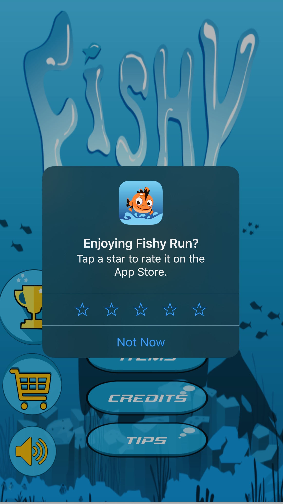

# GodotRequestReview
Godot module for prompting users to leave a review for your godot app in the App Store

__How to use in your project__

Place this module within the modules folder inside your godot source directory

_initialise variable_

```
var iphoneRequestReview
if OS.get_name() == 'iOS':
    iphoneRequestReview = Engine.get_singleton("GodotRequestReview")
```

_request review within your app logic_

```
...
iphoneRequestReview.requestReview()
...
```
Example in Game


